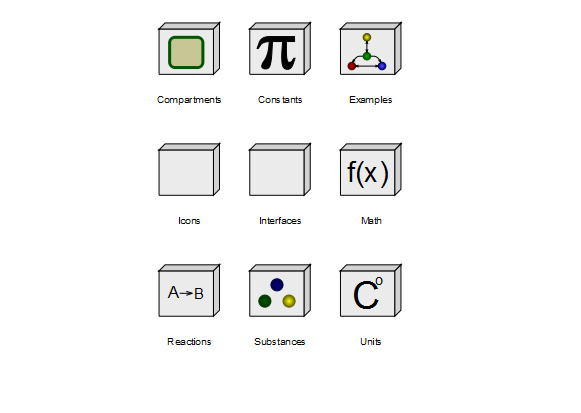

# BioChem

Free library for biochemical modeling and simulation with Modelica.

## Library description

The design idea behind the `BioChem` library is to create a general purpose Modelica library
for modeling, simulation and visualization of biological and biochemical systems.
The classes implemented in the BioChem library describe substances and reactions that can
take place in-between these substances in a diverse number of biochemical pathways.

## Current release

Download [BioChem v1.1.0 for MSL v4.0.0 (2021-05-02)](../../archive/v1.1.0.zip)

#### Release notes

* [Version v1.1.0 (2021-05-02)](../../archive/v1.1.0.zip)
  * Moving, simplifying and cleaning embedded graphical annotations to own package Icons 
  * A UsersGuide package 
  * Improved implementation of Units package  
* [Version v1.0.3 (2021-04-06)](../../archive/v1.0.3.zip)
  * Conversion script to MSL 4.0.0
* [Version v1.0.2 (2020-06-02)](../../archive/v1.0.2.zip)
  * Summary: All major components into separate *.mo files, Converted to MSL 3.2.3
* [Version v1.0.1 (2013-04-18)](../../archive/v1.0.1.zip)
  * Summary: Converted to MSL 3.2.1
* [Version v1.0 (2009-08-31)](../../archive/v1.0.zip)
  * Summary: Initial version, compatible with MSL v2.2.2

## License

Copyright &copy; 2005-2015 MathCore Engineering AB, Linköpings universitet and Modelica Association

The BioChem library is free software released under the terms of the [Mozilla Public License, version 2.0](https://www.mozilla.org/MPL/2.0/).

## Development and contribution

You may report any issues with using the [Issues](https://github.com/OpenModelica/BioChem/issues) button.

Contributions in the form of [Pull Requests](https://github.com/OpenModelica/BioChem/pulls) are always welcome.
