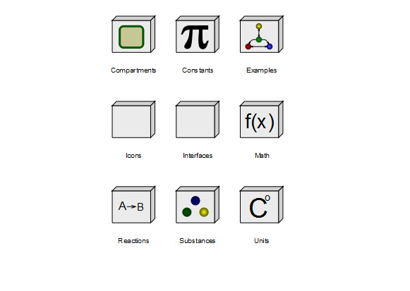

# BioChem

Free library for biochemical modeling and simulation with Modelica.

## Library description

The design idea behind the `BioChem` library is to create a general purpose Modelica library
for modeling, simulation and visualization of biological and biochemical systems.
The classes implemented in the BioChem library describe substances and reactions that can
take place in-between these substances in a diverse number of biochemical pathways.

## Current release

Download [BioChem v1.2 for MSL v3.2.1 (2015-01-19)](../../archive/v1.2.zip)

#### Release notes

* [Version v1.2 (2015-01-19)](../../archive/v1.2.zip)
  * Summary: Improvements to structure, documentation and icons.
* [Version v1.0.1 (2013-04-18)](../../archive/v1.0.1.zip)
  * Summary: Converted to MSL 3.2.1
* [Version v1.0 (2009-08-31)](../../archive/v1.0.zip)
  * Summary: Initial version, compatible with MSL v2.2.2

## License

Copyright &copy; 2005-2014 Wolfram MathCore AB, Linköpings universitet and Modelica Association

This Modelica package is free software and the use is completely at your own risk;
it can be redistributed and/or modified under the terms of the [Modelica License 2](https://modelica.org/licenses/ModelicaLicense2)
with the additional provision that changed parts of BioChem also must be made available under this license.

## Development and contribution

You may report any issues with using the [Issues](https://github.com/OpenModelica/BioChem/issues) button.

Contributions in the form of [Pull Requests](https://github.com/OpenModelica/BioChem/pulls) are always welcome.
